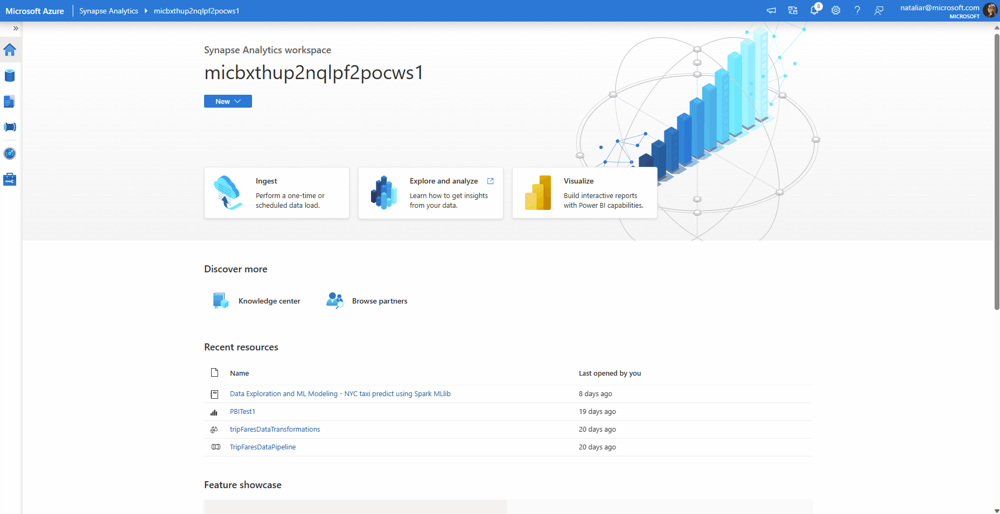
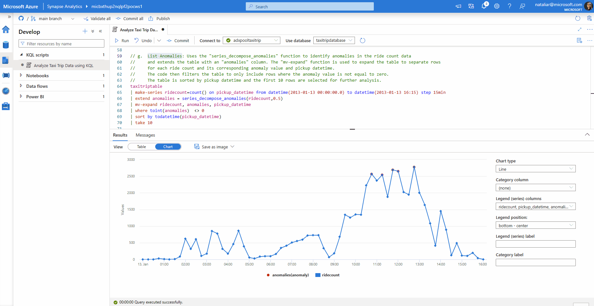

## Module 2: Azure Synapse Data Explorer Pool  
Module 2 will be focused on the basic steps to load and analyze the Trip Data (time-series data) with Data Explorer Pool for Azure Synapse.  

## Create a Data Explorer Pool  
1. In Synapse studio, on the left-side pane, select **Manage > Data Explorer pools**
2. Select **New**, and then enter the following details on the **Basics** tab:  
   | Setting | Value | Description |
   |:------|:------|:------
   | Data Explorer Pool Name | adxpooltaxitrip | This is the name the Data Explorer pool will have |
   | Workload | Compute Optimized | This workload provides a higher CPU to SSD storage ratio. |
   | Node Size | Small(4 cores) | Set this to the smallest size to reduce costs for this quickstart |  
 3. Select **Review + Create > Create.** Your data explorer will start the provisioning process. Once it is complete move on to the next step.

## Create a Data Explorer Database  
1. In Synapse Studio, on the left-side pane, Select **Data**.  
2. Select + (Add new resource) > **Data Explorer Database** and paste the following information:  
   | Setting | Value | Description |
   |:------|:------|:------
   | Data Explorer Pool Name | adxpooltaxitrip | The name of the Data Explorer pool to use |
   | Name | taxitripdatabase | This database name must be unique within the cluster. |
   | Default retention period | 365 | The time span (in days) for which it's guaranteed that the data is kept available to query. The time span is measured from the time that data is ingested. |   
   |Default cache period | 31 | The time span (in days) for which to keep frequently queried data available in SSD storage or RAM, rather than in longer-term storage  
3. Select **Create** to create the database. Creation typically takes less than a minute.  

## Ingesting Taxi Trip data  

1. In Synapse studio, on the left-side pane, select **Data** 
2. Right-click ADX database and click on **Open in Azure Data Explorer**. This opens the Azure Data Explorer web UI. 
3. Once in the web UI click on the **Data** tab on the left. This opens the ADX "One-Click UI", where you can quickly ingest data, create database tables, and automatically map the table schema.  
4. Click on **Ingest data**, and then enter the following details:
   | Setting | Value | Description |
   |:------|:------|:------
   | Cluster | adxpooltaxitrip | Enter name of Data Explorer pool created |
   | Database | taxitripdatabase | Enter name of database created |
   | New Table | taxitriptable | Enter the name for the table that will hold the taxi trip data | 
6. Select **Next**, and then enter the following information for **Source**:
   - Under *Source type* choose **File**.
   - Under *Upload Files -> Browse Files -> File Name* paste the following Github URL: https://github.com/Azure/Test-Drive-Azure-Synapse-with-a-1-click-POC/raw/main/tripDataAndFaresCSV/trip-data.csv
   - Ensure the **trip-data.csv** file was properly uploaded by seeing a green checkmark under the **status** column.
7.  Select **Next: Schema** and leave all the information as default. This page displays the schema and a partial data preview of the **taxitriptable** that will be created.
8.  Select **Next: Start Ingestion** and this will begin the ingestion process for the data. It is complete once all the files display a green checkmark. Click **Close** to complete.
9.  Validate ingestion by selecting **Query** on the left-side pane, clicking on the taxitripdatabase -> taxitriptable and you will see all of the data within the table. The same will be found in Synapse studio. 

   
## Analyze Taxi Trip Data using KQL

1. In Synpase studio, on the left-side pane, select **Develop**  
2. Under 'Notebooks' dropdown on the left side of the screen, click on the KQL notebook named 'Analyze Taxi Trip Data using KQL'  
3. Once in the notebook, ensure you are connected to your ADX pool **'adxpooltaxitrip'** and database **'taxitripdatabase'** and then run each of the sections (a-i) of the script separately and observe the results:  

   *a.* Counts the number of records in the **'taxitriptable'**.  
   
        

   *b.* Summarizes the minimum and maximum values of the *'pickup_datetime'* columns in the **'taxitriptable'**.   
   
        
   
   *c.* Summarizes the count of records in the **'taxitriptable'** by grouping them into daily intervals based on the *'pickup_datetime'* column.  
   
          
      
   *d.* Filters the **'taxitriptable'** to select records with pickup datetime between January 1, 2013, 01:04:00 (UTC) and January 19th, 2013, 19:49:49 (UTC) (which are the min and max found in step b), then counts the number of rides in 15 minute intervals within that time range, and finally visualizes the results as a time chart.
   
        
      
   *e.* Now we are trimming the tails of the dataset by filtering the **'taxitriptable'** to select records with a pickup datetime between January 13, 2013, 00:00:00 and January 13, 2013, 16:15:00. Similarly it then counts the number of rides in 15 minute intervals within that time range, and finally visualizes the results as a time chart. Ultimately, this timechart shows the pattern of ridecount through out the day.  
   
        
   
   *f.* It it uses the *"series_decompose_anomalies"* function to identify anomalies in the ride count data with a threshold of 0.5. Then, it visualizes the anomalies as an anomaly chart titled "Anomalies on NYC taxi rides". Anomalies can be seen as red dots on the chart.  
   
       
     
   *g.* Uses the *"series_decompose_anomalies"* function to identify anomalies in the ride count data and extends the table with an *'anomalies'* column. The *"mv-expand"* function is used to expand the table to separate rows for each ride count and its corresponding anomaly value and pickup datetime. The code then filters the table to only include rows where the anomaly value is not equal to zero. The table is sorted by pickup datetime and the first 10 rows are selected for further analysis.  
   
        
      
   *h.* Uses the *"series_decompose_anomalies"* function to decompose the ride count data into anomalies, score, and baseline values. The table is expanded to separate rows for each anomaly, pickup datetime, ride count, score, and baseline. Finally, the table is projected to include the anomalies, pickup datetime, ride count, score, and baseline columns, where the anomalies column is set to null if the anomaly value is 0.  
   
        
      
   *i.* This code retrieves data from the **'FaresData'** table using a SQL request. It then projects specific columns from the retrieved data, including converting some columns to specific data types. Finally, it performs a left outer join with the *"taxitriptable"* table based on matching values in the *"medallion"*, *"hack_license"*, *"vendor_id"*, and *"pickup_datetime"* columns. Overall, it joined data from synapse SQL pool and data explorer pool to visualize later in PowerBI.  
   
      
   
## Steps for PowerBI integration and visualization

1. We will now proceed to visualize the time chart, which was previously generated to display the pattern of ride counts throughout the day, along with the detected anomalies, baseline, and corresponding scores. This visualization will be accomplished using PowerBI. Start by downloading the following PBI file from the PowerBITemplate folder:  
      
3. Open the downloaded PBI file and provide ServerName, DatabaseName and login credentials. ServerName and DatabaseName can be found in connection strings.  
4. To get the connection string, click on Dedicated SQL Pool. On the left hand side menu, click on connection strings. Copy ServerName and DatabaseName from connection string, paste them in PowerBI and click on 'Load'.
 
   

5. **Important:** Once the file loads you need to edit the *'TripsFares'* query with your ServerName and DatabaseName to execute the previously created query in step i, using your ADX pool in the Power Query Editor. To do this, click on the **Transform** button found in the top ribbon and then click on the *'TripsFares'* query found on the left-hand side menu. After this, open the **Advanced Editor** found in the top ribbon. Now you can copy ServerName and DatabaseName from the connection string and paste them in PowerBI advanced editor, as shown below. Finish by clicking on **Done** and then select **Close & Apply** to apply the changes made. Your visualization should now be fully displayed.
   
     
   
       
  
7. Now change the sensitivity level to 'Public' and save the dashboard. Publish the dashboard to the PowerBI workspace you have created by clicking on 'Publish' and selecting the workspace. In Synapse workspage navigate to Develop --> PowerBI --> Refresh. You see the PowerBI report in Synapse you had published in PowerBI workspace.  

   

8. As one can see from the visualizations below, in Module 1 we were able to visualize all of the ride locations in a given area of New York City along with the *Total Trip Distance*, *Average Trip Distance*, *Average Trip Fare* and *Average Passenger Count*. In module 2, we then visualized the pattern of the number of rides (ridecount) throughout a day (January 13th) in NYC along with the determined anomalies, score and baseline found in that day using the KQL queries and the Data Explorer pool in Synapse.  

**Before: (Module 1)**  

     
   
**After: (Module 2)**  

     
   
## Summarization

- Overall, we were able to see how Synapse Studio is an incredibly powerful tool that brings immense value to analytical workloads in Azure.  It offers a comprehensive suite of analytical components, including Pipelines, Spark, SQL, Data Explorer, and Power BI, all within a single Azure Resource. This integrated approach enhances efficiency and delivers exceptional benefits to users. 
- More specifically, as we saw here Azure Data Explorer (ADX) is a valuable component offered by Synapse Studio. ADX proved to be a fast and highly scalable analytics service optimized for querying and analyzing large volumes of diverse data in real-time. In this case, we saw that it is particularly well-suited for working with time series data due to its efficient storage and querying capabilities. Additionally, its integration with Synapse Studio allows users to perform ad-hoc data exploration and gain instant insights from massive datasets, facilitating rapid decision-making.
- Furthermore, Synapse Studio seamlessly integrates with Power BI, a leading business intelligence platform. This integration enables users to create interactive visualizations, dashboards, and reports based on their data. It empowers users to share compelling insights with stakeholders, enhancing collaboration and facilitating data-driven decision-making.
- By providing these purpose-built analytical components within a single Azure Resource, Synapse Studio eliminates the complexity and overhead associated with managing multiple tools and integrations. It offers a cohesive environment for end-to-end data analytics, catering to diverse workload needs efficiently and effectively.

